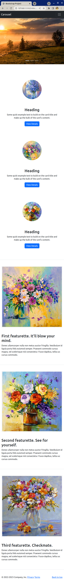

# Responsive Bootstrap Webpage

This challenging exercise is about practicing Bootstrap. It is more important to use the Bootstrap documentation and work with the Bootstrap system than to get the perfect output!

## What you will be doing

Create the webpage shown in the reference image below using _only_ Bootstrap 5.3.0. classes - no CSS necessary. Keep checking that page is responsive for each task you complete.

Make your webpage as close to the examples as possible, but get the basic structure in place first and use any extra time to perfect it.

### Example

Notice the layout differences between mobile and desktop sizes.

## Tasks

### Task 1

- Work in the included `index.html`
- Include Bootstrap from a CDN into the `head` element
  - Version 5.3.0.
  - Include both CSS and JS

### Task 2

- Create the footer first
  - This is the simplest section
  - Create one div that you turn into a flexbox (with Bootstrap!)
    - First flex item contains the text for the copyright, privacy and terms
    - Second flex item has a "Back to top" link
  - No need to add responsiveness

### Task 3

- Create the cards section
  - This is the section below the carousel, and above the featurettes
  - Compare the desktop and mobile layout
  - Hint: refer to [the columns documentation](https://getbootstrap.com/docs/5.3/layout/columns/#column-breaks)
  - Use the `card` component
  - Other classes from Bootstrap can be used as well, such as
    - Sizing utilities
    - Spacing utilities
    - Borders utilities
    - Flex utilities

### Task 4

- Create the featurettes section
  - Compare the desktop and mobile layout
  - This is done mainly with `container`, `row` and columns
  - Other classes from Bootstrap can be used as well, such as

### Task 5

- Create the navigation bar using the `navbar` component

### Task 6

- Create the slideshow using the `carousel` component

## Hints

[Live Version](https://digitalcareerinstitute.github.io/live-demo-responsive-bootstrap/)
