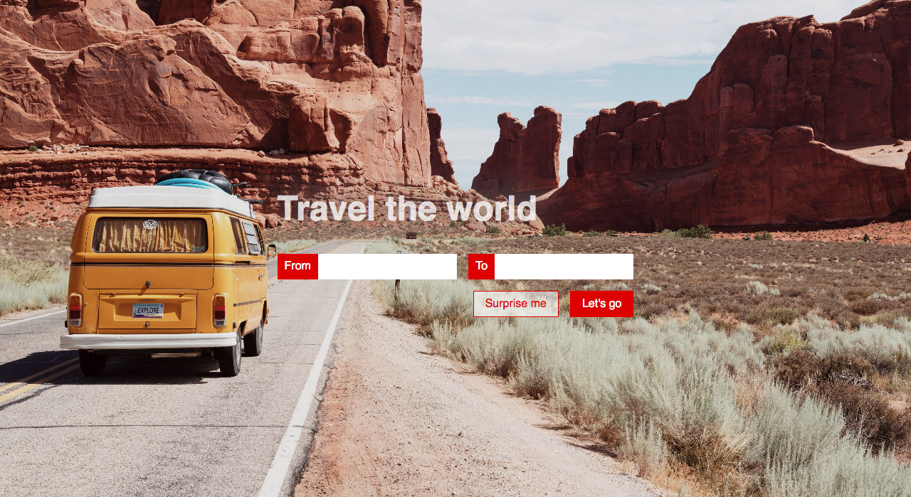

# Travel Destination Form

Create a travel form as shown in the mockup below:

#### Specifications

> - Create a Form with two fields: `From` and `To`.
> - Make both fields required.
> - Input fields should have corresponding labels.
> - Make sure your form has `Surprise me` and `Let's go` buttons.
> - Use the `Let's go` Button as the form submission button.

#### Styling

> - Give the page a nice background image. You will find an image provided in the `images` folder
> - Style the Input fields to change their outline color on `focus`.
> - Style the buttons to your further liking :).
